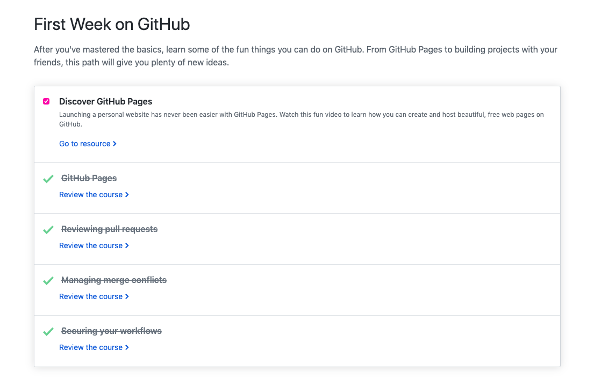
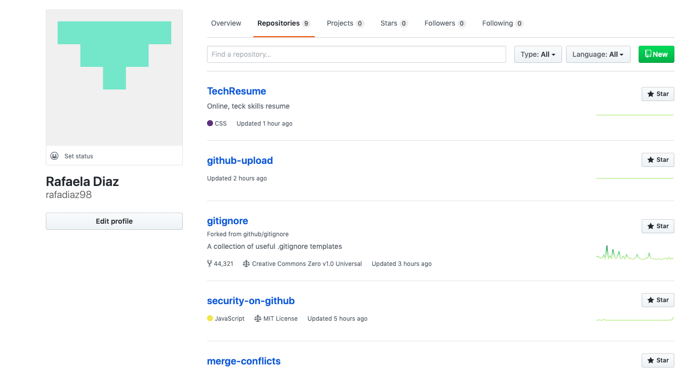

<h1>Technical Skills Resume</h1>
<h2>Welcome</h2>
Hello! My name is Rafaela Diaz and I am a senior Computer Information Systems major. Welcome to my repository where you will find the technical training and certifications that I have acquired through my coursework at the University of Tulsa. Thank you!

<h2>Technical Skills</h2>

GitHub

  I completed the following courses in the <a href="https://lab.github.com/courses">GitHub Learning Lab</a>. These courses helped me understand the basic Github workflow and taught me many useful fundamental Github skills such as how to stand up static pages, create and manage pull requests, facilitate collaboration, the use of Markdown and HTML to format webpages, and more. 
  
<h4>Courses:</h4>
<ul>
<li>Introduction to GitHub</li>
<li>Communicating using Markdown</li>
<li>Uploading your project to Github</li>
<li>GitHub Pages</li>
<li>Reviewing pull requests</li>
<li>Managing merge conflicts</li>
<li>Securing your workflows</li>
</ul>
 

 
 

 
          

Power BI

  I completed the <a href="https://www.edx.org/course/analyzing-and-visualizing-data-with-power-bi-0">Analyzing and Visualizing Data with Power BI</a> course on edX and completed the following courses. These courses taught me how to input data from different data sources, create interactive visual reports, add and modify elements on a dashboard, and transform and interpret different kinds of data. 
  
        <h4>Courses:</h4> 
        <ul>
        <li>Power BI Desktop Data Transformations</li>
        <li>Power BI Desktop Modelling</li>
        <li>Power BI Desktop Visualization</li>
        <li>Power BI Service</li>
        <li>Working with Excel</li>
        <li>Direct Connectivity</li>
        <li>Developer API</li>
        <li>Mobile App</li>
        </ul>
         
        
         
     
  

  

Linux

  

PowerShell

  

Amazon Web Services (AWS)

        

 
