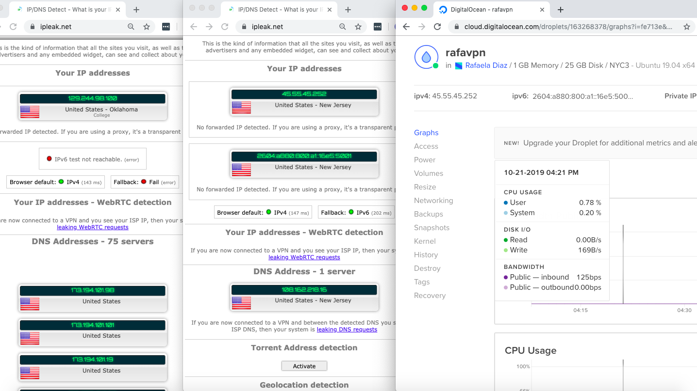
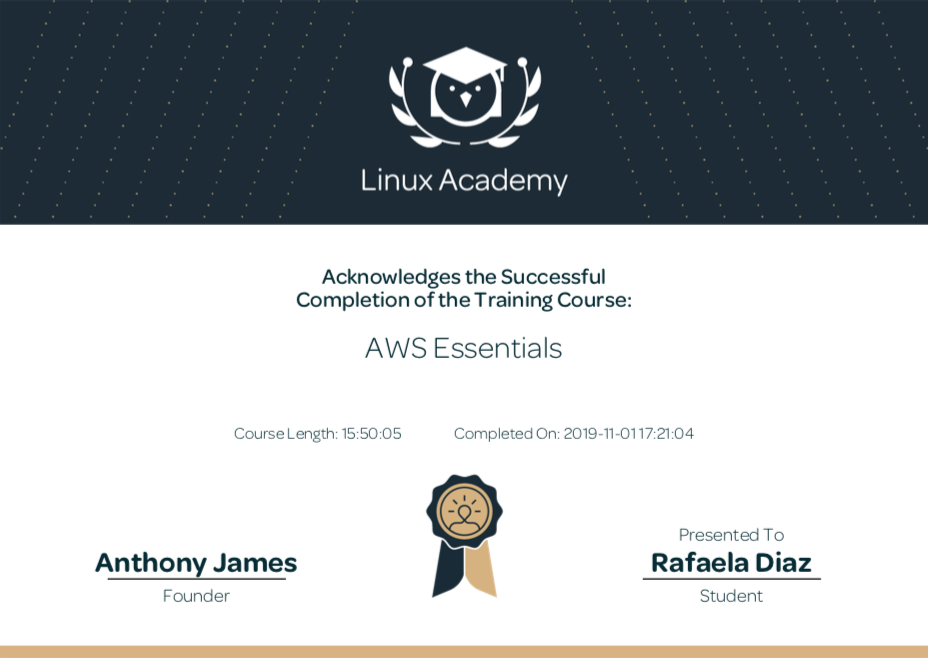
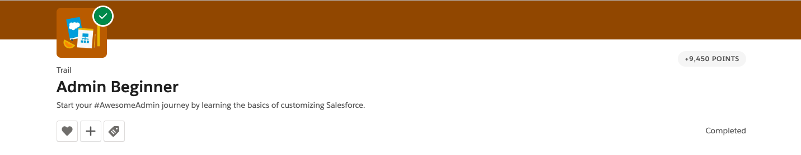
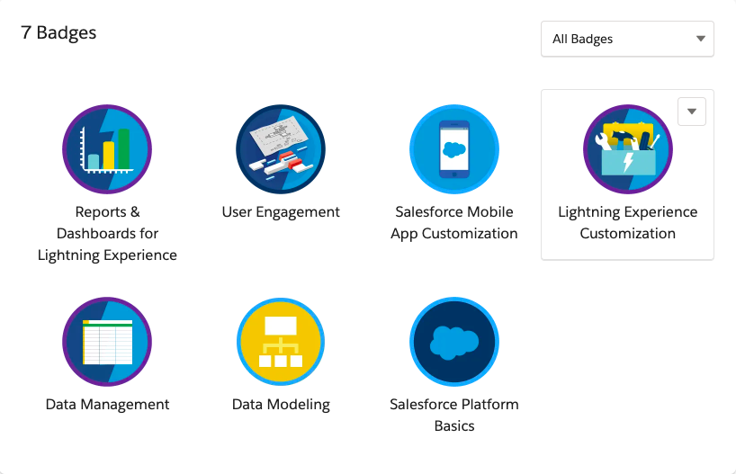

<h1>Technical Skills Resume</h1>
<h2>Welcome</h2>
Hello, welcome to my technical resume! My name is Rafaela Diaz and I am BBA graduate from the University of Tulsa's Computer Information Systems program at Collins College of Business. Welcome to my repository where you will find the technical training and certifications I have acquired through my experience at the University of Tulsa. Thank you for taking a look!

<h2>Technical Skills</h2>

GitHub

          
  I completed the following courses in the <a href="https://lab.github.com/courses">GitHub Learning Lab</a>. These courses helped me understand the basic Github workflow and taught me many useful fundamental Github skills such as how to stand up static pages, create and manage pull requests, facilitate collaboration, the use of Markdown and HTML to format webpages, and more. 
  
<h4>Courses:</h4>
<ul>
<li>Introduction to GitHub</li>
<li>Communicating using Markdown</li>
<li>Uploading your project to Github</li>
<li>GitHub Pages</li>
<li>Reviewing pull requests</li>
<li>Managing merge conflicts</li>
<li>Securing your workflows</li>
</ul>
 

 
 

 
          

Power BI

          
  I completed the <a href="https://www.edx.org/course/analyzing-and-visualizing-data-with-power-bi-0">Analyzing and Visualizing Data with Power BI</a> course on edX and completed the following courses. These courses taught me how to input data from different data sources, create interactive visual reports, add and modify elements on a dashboard, and transform and interpret different kinds of data. 
  
<h4>Courses:</h4> 
<ul>
<li>Power BI Desktop Data Transformations</li>
<li>Power BI Desktop Modelling</li>
<li>Power BI Desktop Visualization</li>
<li>Power BI Service</li>
<li>Working with Excel</li>
<li>Direct Connectivity</li>
<li>Developer API</li>
<li>Mobile App</li>
</ul>
 

 
  
After completing the Power BI edX course, I created the following dashboard using the <a                                       href="https://docs.microsoft.com/en-us/power-bi/sample-datasets#the-power-bi-samples-as-excel-files">Supplier Quality         Analysis sample data</a> provided by Microsoft. This dashboard shows the skills and knowledge I have gained throughout         this course, by using different visualization charts to effectively represent and communicate complex datasets.
Click the following link to watch a demonstration of my Power BI dashboard: <a                                                 href="https://youtu.be/b664ZzpZtSk">Rafaela Diaz Supplier Quality Analysis Dashboard Video</a>.
A link to my shared Dashboard in PowerBI is also available here: <a href="https://app.powerbi.com/groups/me/dashboards/3edb2d08-7596-4fa2-a038-d77650484157?ctid=d4ff013c-62b7-4167-924f-          5bd93e8202d3">Rafaela Diaz Supplier Quality Analysis Dashboard in Power BI</a>.
 
  

 
 
 

 

Tableau

       
 For my Business Intelligence and Data Visualization CIS course, besides learning basic data analytics, I had the opportunity to gain experience and
 develop a working familiarity with the grounding principle of data visualization using Excel, Power BI, as well as Tableau. The extent of this course
 allowed me to understand how to implement data visualization tools, incorporate real datasets from multiple large-scale cases and convey data in an
 impactful way. Some of my course learning objectives were to understand fundamental design principles of effective visualizations, utilize popular 
 visualization applications such as Excel, Power BI, and Tableau, and demonstrate the ability to use technology tools to analyze data and report effectively.
      
       
     <h4>Tableau Skills Learned:</h4> 
     <ul>
     <li>Connecting to Data Sources</li>
     <li>Filtering and sorting data</li>
     <li>Creating Groups and Hierarchies</li>  
     <li>Creating Sets, Reference Lines, and Parameters</li>
     <li>Creating Calculations, Dashboards, and Stories</li>
     </ul>
       
       
     After completing the course, I created a Tableau Final Project for the class where I visually represented important and relevant information based on a 
     COVID-19 data Excel dataset. Some of the visual analytics I used in my project include visualizations, dashboards, a story, calculated fields, sets, 
     and parameters. The following images are screenshots of my Tableau Project on real COVID-19 data. 
      
       
     
      
      

  

Linux

          
 I completed the LPI Linux Essentials Certification course on <a href="https://linuxacademy.com/">Linux Academy</a>. 
These courses helped me get started with the Linux operating system and the Linux kernel, as well as getting the basic skills for the Linux command line syntax. 
 
  
<h4>Topics:</h4>
<ul>
<li>Linux Evolution and Popular Operating Systems</li>
<li>Major Open-Source Applications</li>
<li>Open-Source Software and Licensing</li>  
<li>ICT Skills and Working in Linux</li> 
<li>Command Line Basics</li>
<li>Using the Command Line to Get Help</li>
<li>Using Directories and Listing Files</li> 
<li>Creating, Moving, and Deleting Files</li> 
<li>Archiving Files on the Command Line</li> 
<li>Searching and Extracting Data from Files</li>
<li>Turning Commands into a Script</li>
<li>Choosing an Operating System</li>
<li>Understanding Computer Hardware</li>
<li>Where Data Is Stored</li> 
<li>Your Computer on the Network</li> 
<li>Basic Security and Identifying User Types</li> 
<li>Creating Users and Groups</li> 
<li>Managing File Permissions and Ownership</li>  
<li>Special Directories and Files</li>
</ul>
<h4> Certificate: </h4>

   
          

   

VPN

 
I installed the lastest version of Ubuntu server and configured my own IPSEC VPN in the cloud using the <a href="https://github.com/trailofbits/algo">Algo VPN</a> Ansible scripts provided by Trail of Bits. With the help of this tutorial, I successfully deployed the Algo server, configured VPN clients, set up an SSH tunnel, and added and removed users. 
I also had to set up an account with Digital Ocean, a cloud hosting provider, to run the VPN and download the Wireguard app for macOS to enable my VPN clients. 
 
 
 
 
 

  

Amazon Web Services (AWS)

 
 I completed the AWS Essentials course on <a href="https://linuxacademy.com/">Linux Academy</a>. The course introduced me to the core AWS services, helped set up my own AWS account, and I was challenged with real-world scenarios and hands-on activities using the Linux live environment. I was provided with an introduction to Amazon's Identity Access Management, Elastic Compute Cloud, database services, Simple Notification System, Elastic Load Balancers, Auto Scaling, and Route 53. 
 
 
       
<h4>Topics:</h4>
<ul>
<li>AWS Essentials</li>
<li>Managing AWS Access with Users, Groups, and Roles</li>
<li>Identity and Access Management (IAM)</li>
<li>Networking Services and Connectivity</li>
<li>Virtual Private Cloud (VPC)</li>
<li>Compute Services</li>
<li>Elastic Cloud Compute (EC2)</li>
<li>Storage Services</li>
<li>Database Services</li>
<li>Monitoring, Alerts, and Notifications</li>
<li>Simple Notification Service (SNS)</li>
<li>Load Balancing, Elasticity, and Scalability</li>
<li>Elastic Load Balancer (ELB)</li>
<li>Auto Scaling</li>
<li>Route 53</li>
<li>Serverless Computing - Lambda</li>
</ul>
  

 
 
      

PowerShell

  
I completed the PowerShell 5 Essential Training on <a href="https://www.linkedin.com/learning/powershell-5-essential-training/welcome">LinkedIn Learning</a>.This training provided me a detailed overview and learning experience of Powershell 5 including how to get a hand from the help system, extend PowerShell with modules and snap-ins, harness the power of the PowerShell pipeline, and script and automate common administrative tasks. I was also introduced to one of PowerShell's most exciting features, remote management, which can be very useful for scaling management. 
 
 
       
<h4>Topics:</h4>
<ul>
<li>Installing Windows Management Framework 5</li>
<li>Running commands (cmdlets)</li>
<li>Discovering commands</li>
<li>Understanding cmdlet syntax</li>
<li>Resolving terse commands</li>
<li>Finding and using local modules</li>
<li>Working with files, printers, CSVs, and XML in the pipeline</li>
<li>Selecting, sorting, and filtering object data</li>
<li>Creating scripts</li>
<li>Automating tasks</li>
<li>Using PowerShell remoting</li>
</ul>
  

 
 
  

     

Salesforce

 
I completed the Salesforce Admin Beginner training course on <a href="https://trailhead.salesforce.com/en/content/learn/trails/force_com_admin_beginner">Trailhead Salesforce</a>. This course taught me the basics of customizing and managing the Salesforce platform as an administrator and introduced me to some core skills including general, reporting, moblile, database, and data management skills. The modules covered in this training provided me a detailed overview of important tasks and subjects that are useful to know to get around Salesforce as an admin and enhance the user-side experience. 
 
 
       
<h4>Topics:</h4>
<ul>
<li>Salesforce Platform Basics</li>
<li>Data Modeling</li>
<li>Data Management</li>
<li>Lightning Experience Customization</li>
<li>User Engagement</li>
<li>Reports & Dashboards for Lightning Experience</li>
</ul>
  

 
 

  

        

 
